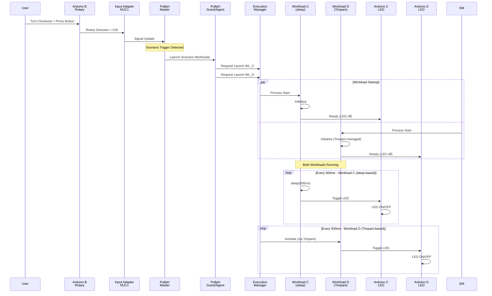
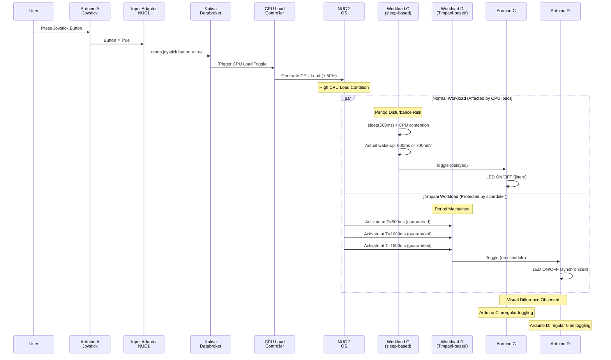
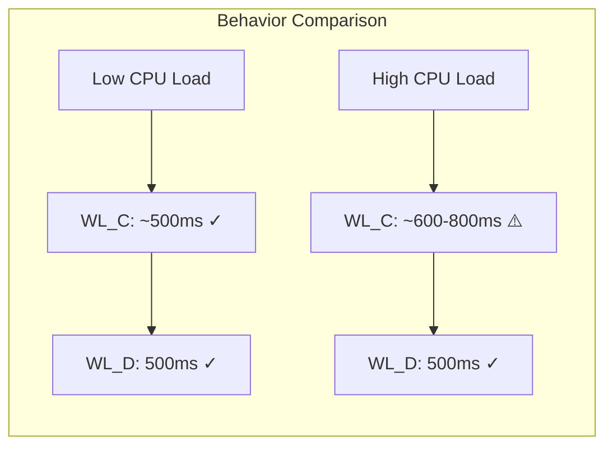

## Introduction

The **Scenario Workload Blueprint** demonstrates how a multi-node SDV runtime can maintain deterministic workload behavior under CPU load by combining **Eclipse Pullpiri** workload orchestration, **Kuksa Databroker** signal exchange, Arduino-based physical I/O, and **Eclipse Timpani** time-triggered scheduling.

This blueprint is built around a simple but practical question:

> When CPU load increases on a guest node, what is the behavioral difference between a normal periodic workload and a workload scheduled by Timpani?

The demo shows that a normal workload using application-level `sleep(0.5s)` can lose its intended 0.5-second period when CPU load is increased, while a workload activated by Timpani continues to maintain its 0.5-second period. At the same time, the two workloads are designed to preserve time synchronization at the scenario level, so the LED ON/OFF behavior remains synchronized between the two LED strips.

The purpose of this blueprint is not to implement safety-critical control. Instead, it provides a QM-level operational demonstration of scenario-based workload launch, workload termination, resource-load triggering, timing behavior comparison, and multi-node signal synchronization.

## Blueprint Objective

The objective of this blueprint is to demonstrate a **scenario workload execution model** in which:

- two scenario workloads run on a guest node,
- one workload is a normal application-level periodic workload,
- the other workload is scheduled by Timpani,
- CPU load on the guest node can be increased or decreased by a remote joystick input,
- workload lifecycle can be controlled by a remote rotary encoder input,
- and both workloads keep LED ON/OFF synchronization even when their scheduling mechanisms differ.

In this demo, the normal workload wakes up every 0.5 seconds using `sleep`, while the Timpani workload is activated every 0.5 seconds by the Timpani scheduler. When CPU load is increased on the guest node, the normal workload may fail to maintain the exact 0.5-second period. In contrast, the Timpani-scheduled workload continues to preserve the configured 0.5-second activation period.

This makes the scheduling difference visible through physical LED strips connected to Arduino devices.

## Demo Topology

The demo uses two NUCs and four Arduino devices.

## Device Roles

### Arduino A: Joystick

Arduino A is connected to the master NUC.

Each time the joystick button is pressed, a signal is sent through Kuksa Databroker to the CPU load controller running on the guest NUC.

The CPU load controller repeatedly changes the guest NUC CPU load between higher and lower load states.

This input is used to create a runtime condition where the behavior of the normal workload and the Timpani-scheduled workload can be compared.

### Arduino B: Rotary Encoder

Arduino B is connected to the master NUC.

When the rotary encoder is turned clockwise and the button is pressed, two scenario workloads are launched on the guest node.

When the rotary encoder is turned counterclockwise and the button is pressed, the scenario workloads running on the guest node are terminated.

This demonstrates scenario-level workload lifecycle control through Pullpiri.

### Arduino C: LED Strip

Arduino C is connected to the guest NUC.

It is controlled by the normal scenario workload. Whenever Arduino C receives a signal from the workload, the LED strip toggles ON/OFF.

The workload controlling Arduino C wakes up every 0.5 seconds using application-level sleep and then sends a signal to Arduino C.

Under increased CPU load, this workload may experience timing jitter or period drift because its periodic behavior depends on normal application scheduling.

### Arduino D: LED Strip

Arduino D is connected to the guest NUC.

It is controlled by the Timpani-scheduled scenario workload. Whenever Arduino D receives a signal from the workload, the LED strip toggles ON/OFF.

Unlike the normal workload, this workload is activated by Timpani every 0.5 seconds and then sends a signal to Arduino D.

Even when CPU load increases on the guest NUC, this workload is expected to maintain the configured 0.5-second period through Timpani-based time-triggered scheduling.

## Scenario Behavior

### 1. Launch Scenario Workloads

The user turns Arduino B clockwise and presses the rotary button.

After this action, both LED workloads start running on the guest node.
This workload uses application-level sleep to generate a 0.5-second period. Under normal CPU conditions, the LED strip toggles at the intended interval. When CPU load increases, the sleep-based period can be disturbed.
This workload is activated by Timpani every 0.5 seconds. Even when CPU load increases, the workload is expected to preserve its configured activation period.

### 4. CPU Load Trigger

The user presses the joystick button on Arduino A.

The CPU load controller changes the CPU load of the guest NUC. This creates the condition needed to compare normal scheduling behavior against Timpani-based scheduling behavior.

## Expected Demonstration Result

The expected result of the demo is as follows:

| Condition | Normal workload | Timpani-scheduled workload |
|---|---|---|
| Low CPU load | Maintains approximately 0.5-second period | Maintains 0.5-second period |
| High CPU load | 0.5-second sleep period may be disturbed | Maintains 0.5-second activation period |
| LED behavior | Arduino C toggles ON/OFF | Arduino D toggles ON/OFF |
| Scenario-level sync | LED sync is preserved by design | LED sync is preserved by design |

The visual observation point is the LED behavior of Arduino C and Arduino D.

- Arduino C shows the behavior of a normal sleep-based workload.
- Arduino D shows the behavior of a Timpani-scheduled workload.
- When CPU load is increased, the difference in scheduling stability becomes visible.
- Despite the difference in execution mechanism, LED ON/OFF synchronization is maintained at the scenario level.

## Architectural Intent

This blueprint separates responsibilities as follows:

- **Pullpiri** handles scenario workload lifecycle control, such as launch and termination.
- **Kuksa Databroker** carries signals between Arduino input adapters and guest-node workloads.
- **Timpani** provides time-triggered activation for the Timpani-scheduled workload.
- **Normal workload logic** demonstrates application-level periodic execution using sleep.
- **Arduino devices** provide physical input and visual output for the scenario.
- **CPU load controller** creates a controlled resource-pressure condition on the guest node.

This separation makes the demo easy to understand and reproduce.

## Scope

This blueprint is in scope for:

- multi-node workload orchestration,
- scenario workload launch and termination,
- CPU load-triggered runtime behavior comparison,
- application-level periodic execution,
- Timpani-based time-triggered execution,
- LED-based physical visualization,
- Kuksa-based signal exchange,
- and scenario-level time synchronization.

This blueprint is out of scope for:

- ASIL safety decision making,
- direct actuator control,
- vehicle motion control,
- trajectory planning,
- safety fallback logic,
- hardware-specific resource enforcement,
- and replacement of AUTOSAR Adaptive execution management.

## Why This Blueprint Matters

This blueprint provides a compact physical demonstration of a common SDV runtime problem: normal application-level periodic execution can be affected by resource pressure, while scheduler-driven activation can preserve deterministic timing behavior.

By using two NUCs, four Arduino devices, Pullpiri, Kuksa Databroker, and Timpani, the blueprint makes this behavior observable without requiring a full vehicle setup.

It helps developers and adopters understand:

- how scenario workloads can be launched and terminated across nodes,
- how resource pressure can be introduced as a runtime trigger,
- how normal and time-triggered workloads behave differently under CPU load,
- how physical devices can make orchestration behavior visible,
- and how scenario-level synchronization can be maintained across different workload execution modes.

## Short Description

The Scenario Workload Blueprint demonstrates a two-NUC, four-Arduino physical SDV demo using Pullpiri, Kuksa Databroker, and Timpani. A joystick input triggers CPU load changes on the guest node, while a rotary encoder launches or terminates two scenario workloads. One workload uses normal 0.5-second sleep-based periodic execution to toggle an LED strip, and the other is activated by Timpani every 0.5 seconds to toggle another LED strip. Under CPU load, the normal workload period may be disturbed, while the Timpani-scheduled workload maintains its configured period. The two workloads are designed to preserve scenario-level LED ON/OFF synchronization.
